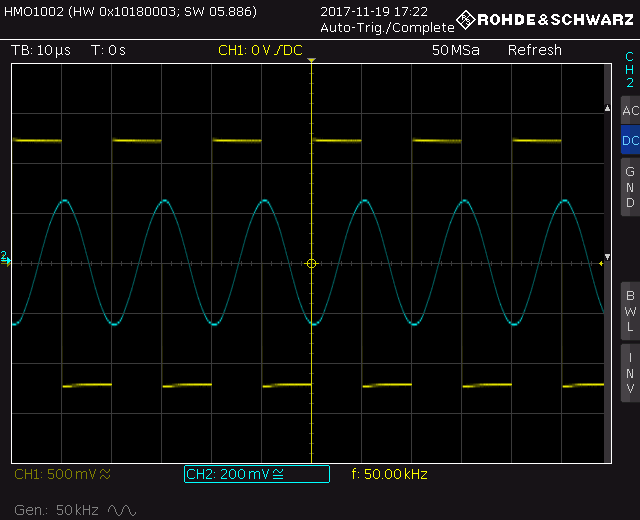

# HMO1002

Program for controlling the oscilloscope HMO1002 from the terminal.

Newly supports both USB virtual COM port and 100Mbps Ethernet connection and communication using sockets.



## Linux Instalation:

```bash
# require python3 or higher
# install python library for serial communication
sudo apt install python3-serial
# clone repository
git clone git@github.com:wykys/HMO1002.git
# change directory
cd HMO1002
# creating a symbolic link
ln -s $(pwd)/osc.py ~/.local/bin/hmo1002
# run
hmo1002 # args or ./osc.py args
# remove
sudo rm /usr/bin/osc
```

## Params

Main parameters for using the program.

### Main Help

`hmo1002 -h`

```
usage: osc [-h] [-i {uart,ethernet}] {screenshot,autoscale,time_base,fgen,measurement,export} ...

positional arguments:
  {screenshot,autoscale,time_base,fgen,measurement,export}
                        commands
    screenshot          save screenshot
    autoscale           autoscale oscilloscope
    time_base           sets the horizontal scale for all channel and math waveforms
    fgen                function generator
    measurement         starts the automatic measurement
    export              export data

options:
  -h, --help            show this help message and exit
  -i {uart,ethernet}, --interface {uart,ethernet}
                        communication interface with the device
```

### Screenshot

`hmo1002 screenshot -h`

```
usage: osc screenshot [-h] [-f FILE] [-c {color,gray,invert}] [-d]

positional arguments:
  screenshot            save screenshot

options:
  -h, --help            show this help message and exit
  -f FILE, --file FILE  image name, withtou siffix
  -c {color,gray,invert}, --color {color,gray,invert}
                        image colors
  -d, --date            add the current date before the name

```

### Frequency generator control

`hmo1002 fgen -h`

```
usage: osc fgen [-h] [-f FREQ]

positional arguments:
  fgen                  function generator

options:
  -h, --help            show this help message and exit
  -f FREQ, --frequency FREQ
                        output frequency
```

### Measurement

`hmo1002 measurement -h`

```
usage: osc measurement [-h]
                       [-t {module_and_phase_frequency_characteristics,module_characteristic_of_both_channels}]

positional arguments:
  measurement           starts the automatic measurement

options:
  -h, --help            show this help message and exit
  -t {module_and_phase_frequency_characteristics,module_characteristic_of_both_channels}, --type {module_and_phase_frequency_characteristics,module_characteristic_of_both_channels}
                        type of measurement
```
